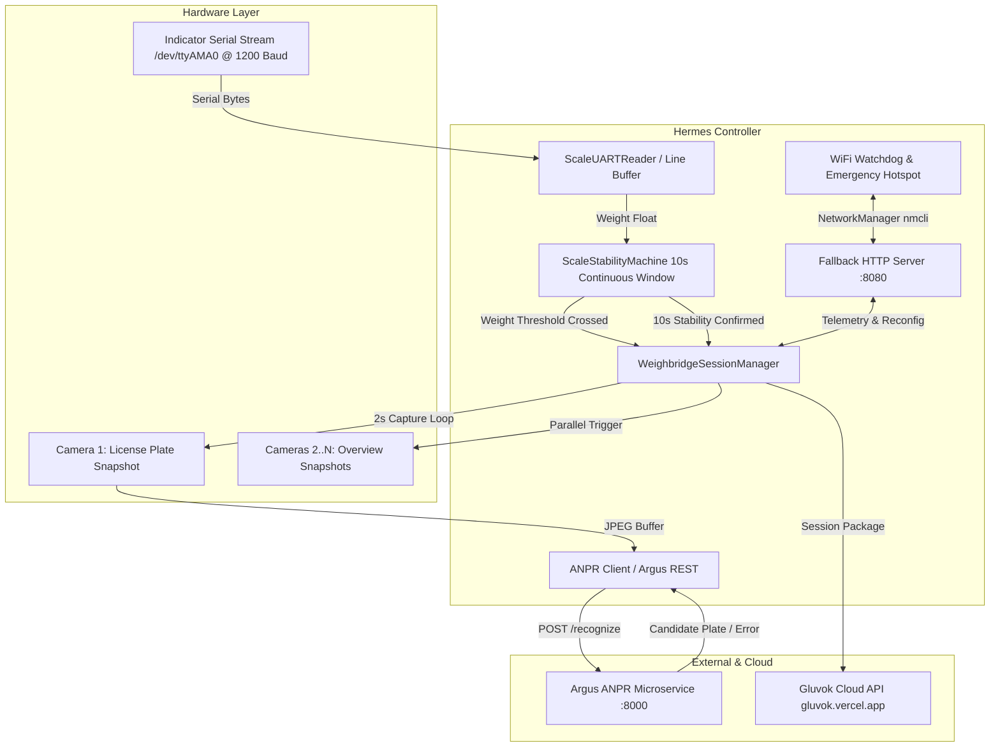
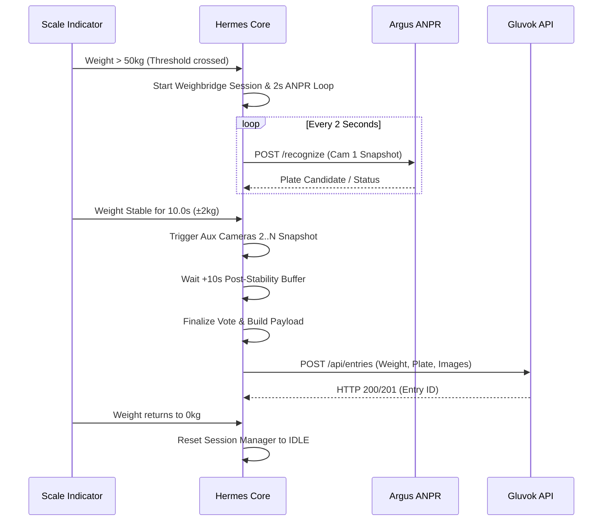

# Hermes System Architecture Guide

`hermes` is an industrial weighing bridge integration controller deployed on a Raspberry Pi. It synchronizes scale serial indicators, automated multi-camera captures, FastAPI-based Argus ANPR (Automatic Number Plate Recognition), emergency fallback Wi-Fi networking, and cloud database persistence via the Gluvok API.

---

## 1. High-Level System Architecture



---

## 2. Core System Capabilities & Key Features

- **Write-Ahead SQLite Local Durability**: Weighments and camera frames are committed to a local SQLite database (`data/hermes.db`) in WAL mode *before* any upload is attempted, guaranteeing zero data loss during power outages or extended network downtime.
- **Edge Anti-Duplication & Idempotency**: Sequential single-flight FIFO dispatcher with atomic task leases (`lease_until`) and a **verify-before-retry** protocol for ambiguous read timeouts, preventing duplicate cloud entries when retrying offline weighments.
- **Weight Scale Serial Parsing**: Reads continuous raw serial stream from UART (`/dev/ttyAMA0` or USB-to-Serial at 1200 Baud 8N1).
- **Weight Stabilization Detection**: 10-second continuous weight stability tracking (`STABILITY_TOLERANCE = 2.0 kg`, `STABILITY_DURATION = 10s`).
- **ANPR Multi-Sample Voting**: Captures Camera 1 frames every 2 seconds during active weighing and selects the highest-frequency plate candidate.
- **Concurrent Auxiliary Camera Snapshots**: Captures overview snapshots from auxiliary cameras in parallel upon weight stabilization.
- **Non-Blocking Real-Time Threading**: Scale serial reading is completely decoupled from disk spooling and network I/O; cloud uploads and camera captures are dispatched in dedicated background threads.
- **Gluvok Cloud API Multipart Integration**: Matches curl specification (`curl -X POST ... -u "pi1:hardware123" -F "center_id=..." -F "detected_vehicle_number=..." -F "weight=..." -F "file=@..."`).
- **Web Diagnostics Dashboard**: Modular Flask application factory on port `8080` displaying live scale weight, ANPR status, cloud spool queue counts, error monitoring, and configuration.
- **Emergency Wi-Fi Hotspot Fallback**: Detects network disconnections via NetworkManager (`nmcli`) and automatically starts an emergency AP (`Gluvok-Setup`) for on-site recovery.

---

## 3. Project Layout & File Structure

```
hermes/
├── main.py                    # Application entry point, setup, and loop
├── pyproject.toml             # Project definition, dependencies, and test config (uv-managed)
├── uv.lock                    # Dependency lockfile
├── README.md                  # Streamlined operational runbook
├── AGENTS.md                  # Code quality, linting, typing, and architectural rules
├── scripts/
│   └── build.py               # Local Nuitka compilation script for bespoke client builds
├── docs/
│   ├── ARCHITECTURE.md        # Deep architectural design, threading, and hardware interfaces
│   └── CODEBASE_REFERENCE.md  # Exhaustive function-by-function developer guide
├── tests/
│   ├── test_anpr_client.py    # ANPR client, response schemas, and plate voting tests
│   ├── test_scale_uart.py     # Scale UART parser, framing, and silence flush tests
│   ├── test_session_fallback.py # Weighbridge session error propagation tests
│   ├── test_cloud_post.py     # Gluvok API multipart and Basic Auth tests
│   ├── test_spool_db.py       # SQLite WAL durable spool, atomic leasing & idempotency tests
│   ├── test_threading_isolation.py # Threading concurrency and non-blocking isolation tests
│   ├── test_web_server.py     # Diagnostics web console & REST API tests
│   └── test_wifi_manager.py   # Wi-Fi watchdog & emergency hotspot fallback tests
└── src/
    ├── config/
    │   ├── __init__.py        # Subpackage exports (`config`, `ConfigManager`)
    │   ├── client_config.py   # Bespoke compiled client configuration (credentials, IDs, URLs)
    │   ├── constants.py       # System timing, timeout constants, buffer sizes & regexes
    │   ├── manager.py         # Unified thread-safe ConfigManager accessor
    │   ├── runtime.py         # Runtime configuration override mutator
    │   └── store.py           # SQLite persistence for runtime overrides (`data/hermes.db`)
    ├── core/
    │   ├── __init__.py         # Subpackage exports
    │   ├── db.py              # SQLite WAL durable outbox store with atomic lease locking
    │   ├── session.py         # Weighbridge session lifecycle & multi-camera coordinator
    │   ├── spool.py           # Background outbox dispatcher & retry worker with verify-before-retry
    │   ├── stability.py       # 10s continuous weight stability state machine
    │   └── telemetry.py       # Decoupled thread-safe telemetry and event log buffer
    ├── devices/
    │   ├── __init__.py         # Subpackage exports
    │   ├── scale.py           # UART serial stream reader & line buffer parser
    │   ├── camera.py          # HTTP snapshot / RTSP frame grabber & parallel aux captures
    │   └── wifi.py            # Automatic Wi-Fi watchdog & emergency hotspot monitor
    ├── integrations/
    │   ├── __init__.py         # Subpackage exports
    │   ├── anpr.py            # Argus ANPR server client & plate voting algorithm
    │   └── gluvok.py          # Gluvok Cloud API client (Basic Auth, multipart upload, verification)
    └── web/
        ├── __init__.py         # Subpackage exports
        ├── app.py             # Flask application factory (create_app)
        ├── auth.py            # Superadmin auth, token sliding, rate limiting, and decorators
        ├── validation.py      # Configuration input sanitization and URL validation utilities
        ├── blueprints/
        │   ├── api.py         # REST API endpoints (/api/status, /api/config, /api/login, etc.)
        │   └── views.py       # Page routes serving the dashboard UI
        ├── server.py          # Threaded WSGI server runner (:8080) & lifecycle management
        ├── static/            # Offline vendor JS bundles (Tailwind CSS v4 & Lucide Icons)
        │   ├── lucide.min.js
        │   └── tailwindcss.js
        └── templates/
            └── index.html     # Real-time Tailwind CSS v4 diagnostics & configuration web UI
```

---

## 4. Subsystem Quick Reference

| Subsystem | Primary Responsibilities | Key Components |
| :--- | :--- | :--- |
| **Core Business Logic & Durable Spool** (`src/core/`) | Orchestrates weighbridge sessions, 10s continuous weight stability (±2 kg), WAL SQLite outbox storage, background FIFO retry dispatcher, and telemetry store. | `db.py`, `spool.py`, `session.py`, `stability.py`, `telemetry.py` |
| **Physical Hardware Devices** (`src/devices/`) | Direct drivers: reads RS-232 serial stream at 1200 baud, HTTP/RTSP camera snapshot grabbers, and Linux NetworkManager (`nmcli`) Wi-Fi watchdog. | `scale.py`, `camera.py`, `wifi.py` |
| **External Integrations** (`src/integrations/`) | Integrates external networks: Argus ANPR microservice with consensus voting, and Gluvok Cloud API with Basic Auth (`-u`), multipart form uploads, and anti-duplicate verification. | `anpr.py`, `gluvok.py` |
| **Diagnostics Web Console** (`src/web/`) | Modular Flask application factory on port `8080` with Tailwind CSS v4 single-page dashboard for live telemetry, spool queue state, system logs, and authenticated configuration. | `create_app`, `FallbackWebServer`, `index.html` |
| **System Configuration** (`src/config/`) | Thread-safe JSON-backed configuration manager (`RLock`), centralized timing/timeout constants, and fallback defaults. | `config_manager.py`, `constants.py` |

---

## 5. Component Breakdown

### 5.1 Core Business Logic (`src/core/`)
- **`WeighbridgeSessionManager` (`session.py`)**:
  - Coordinates the session lifecycle (`PHASE_IDLE` -> `PHASE_STABILIZING` -> `PHASE_POST_STABILITY` -> `PHASE_COMPLETED`).
  - Runs a 2-second capture loop on Camera 1 during the stabilization phase.
  - Assembles the final session package containing stable weight, highest-voted plate, and base64 images.
- **`ScaleStabilityMachine` (`stability.py`)**:
  - Requires weight to exceed `min_weight` (default `50.0 kg`) to trigger a weighing session.
  - Implements a continuous 10-second stability check (`STABILITY_TOLERANCE = ±2.0 kg`, `STABILITY_DURATION = 10.0s`).
  - Once stable, transitions to `SCALE_STABLE_RECORDED` to guarantee strictly one upload per truck session.
  - Resets to `SCALE_IDLE` only when weight drops back to `<= 0.0 kg`.
- **`Telemetry Store` (`telemetry.py`)**:
  - Decoupled, thread-safe store for circular system event logs (`max 20 entries`), latest weighment results, and live error counters.
  - Guards state using dedicated threading locks (`_events_lock`, `_live_lock`).

### 5.2 Physical Hardware Devices (`src/devices/`)
- **`ScaleUARTReader` (`scale.py`)**:
  - Connects to the weighing indicator via serial (`/dev/ttyAMA0` or USB serial at 1200 baud, 8N1).
  - Maintains a thread-safe byte buffer (`bytearray`), handling packet terminators (`\r`, `\n`, STX `\x02`, ETX `\x03`) and an inter-character silence flush (300 ms).
  - Uses regex extraction (`rb"([0-9]{3,6})MN"` and flexible signed float patterns) to parse numeric weights.
- **`Camera Manager` (`camera.py`)**:
  - Low-memory HTTP snapshot grabber with optional OpenCV RTSP single-frame fallback.
  - Concurrently captures overview angles (Cameras 2..N) upon stabilization using a bounded `ThreadPoolExecutor`.
- **`WiFi Manager` (`wifi.py`)**:
  - Continuously monitors active Wi-Fi connection via `nmcli`.
  - Automatically spins up an emergency Wi-Fi Access Point (`Gluvok-Setup` / `gluvok1234`) on `wlan0` if connection to the facility router is lost, allowing on-site technicians to connect directly.

### 5.3 External Integrations (`src/integrations/`)
- **`Argus ANPR Client` (`anpr.py`)**:
  - Sends raw JPEG bytes to the Argus FastAPI microservice endpoint (`/recognize`).
  - Supports both full Argus `RecognitionResponse` schemas and flat JSON schemas with pre-screening error detection (`REJECTED_HUMAN_DETECTED`, `NO_PLATE_DETECTED`).
  - Employs a frequency counter (`get_highest_frequency_plate`) to pick the consensus plate candidate across multi-sample captures.
- **`Gluvok Cloud API Client` (`gluvok.py`)**:
  - Exposes `GLUVOK_BASE_URL` and `get_device_headers()` for stateless edge device authentication (`x-device-id`, `x-device-key`).
  - Validates and sanitizes license plate numbers against Indian registration number patterns (`INDIAN_PLATE_REGEX`).
  - Structures weighment session data and RFC 2397 base64-encoded snapshot images directly for `POST /api/entries`.
  - Handles response status codes: `200`/`201` success, `401 Unauthorized`, `403 Forbidden`, `400 Bad Request`, and server/network errors.

### 5.4 Diagnostics Web Dashboard (`src/web/`)
- **Application Factory (`app.py`)**:
  - Implements `create_app()` constructing the Flask WSGI application with custom error handlers, templates directory bindings, and global security headers (`X-Content-Type-Options: nosniff`, `X-Frame-Options: DENY`).
- **Blueprints (`src/web/blueprints/`)**:
  - `views.py`: Serves the embedded dashboard (`templates/index.html`) across subsystem routes (`/`, `/scale`, `/anpr`, `/cloud`, `/wifi`, `/telemetry`, `/errors`, `/config`).
  - `api.py`: Implements RESTful endpoints:
    - `POST /api/login`: Issues session tokens with sliding 2h expiration, brute-force defense (5 attempts/60s), and constant-time credential comparison (`auth.py`).
    - `GET /api/status`: Real-time operational telemetry snapshot.
    - `GET /api/config` & `POST /api/config`: Live reconfiguration of threshold weight, serial port/baud, and camera URLs with input sanitization (`validation.py`) and dynamic UART restart.
    - `POST /api/wifi` & `POST /api/wifi/clear`: Facility Wi-Fi provisioning and credential clearing.
- **Authentication & Security Middleware (`auth.py`)**:
  - Cryptographic token generator and `@auth_required` decorator supporting `Authorization: Bearer` and `X-Auth-Token` headers.
- **Server Runner (`server.py`)**:
  - `FallbackWebServer` wraps Werkzeug's `make_server` to serve the WSGI application in a background daemon thread with graceful `start()` and `stop()` lifecycle management.

### 5.5 Configuration Management (`src/config/`)
Hermes employs a dual-layer configuration pattern adhering to NASA JPL Rule 4 (≤ 60 lines per file):
- **`client_config.py`**:
  - Bespoke compiled client configuration containing hardcoded, protected values for `DEVICE_ID`, `DEVICE_KEY`, `CENTER_ID`, `MIN_WEIGHT`, `ANPR_SERVER_URL`, and initial hardware defaults.
- **`store.py`**:
  - Thread-safe SQLite store managing the `runtime_config` table in `data/hermes.db` to persist field calibrations and on-site Wi-Fi credentials across reboots.
- **`runtime.py`**:
  - Mutator managing runtime overrides with thread safety (`threading.RLock()`).
- **`manager.py`**:
  - Unified `ConfigManager` exposing system properties with fallback to `client_config`.
- **`constants.py`**:
  - System operational constants, timeouts, buffer sizes, and Indian vehicle registration regex.

---

## 6. End-to-End Weighment Data Flow



---

## 7. Threading & Concurrency Architecture (Raspberry Pi 5 & Python 3.14)

Hermes operates as a real-time industrial appliance controller on a Raspberry Pi 5 (Quad-Core 64-bit Arm Cortex-A76 @ 2.4 GHz) running **Python 3.14**.

### 7.1 Thread Topology & Real-Time Isolation

Because Python 3.14 on a multi-core Pi 5 supports free-threaded CPython (PEP 703 / optional GIL) and releases the GIL during all socket I/O, serial reads, subprocesses, and sleep states, Hermes uses decoupled daemon threads rather than heavyweight multiprocessing:

| Thread Name | Type / Lifecycle | Execution Frequency / Trigger | Non-Blocking Guarantee |
| :--- | :--- | :--- | :--- |
| **`ScaleUART`** | Dedicated Daemon Thread | Continuous (50ms read, 300ms flush) | Reads `/dev/ttyAMA0` serial bytes; never blocks on network or camera I/O. |
| **`FallbackWebServer`** | Werkzeug WSGI Daemon Thread | Persistent on port `:8080` | Serves web UI and REST API asynchronously without delaying scale operations. |
| **`WiFiWatchdog`** | Dedicated Daemon Thread | Every 30.0s | Runs `nmcli` network checks and controls emergency AP fallback independently. |
| **`ANPRLoop_<id>`** | Ephemeral Session Thread | Every 2.0s during weighing | Fetches Cam 1 frame and queries Argus microservice asynchronously. |
| **`AuxCapture_<id>`** | Ephemeral Session Worker | Triggered upon 10s stability | Fetches overview angles (Cams 2..N) via `ThreadPoolExecutor(4)` without stalling serial reads. |
| **`SpoolWorker`** | Dedicated Daemon Thread | Event-driven + 5.0s poll | Sequentially leases records from SQLite WAL queue and uploads to Gluvok API via multipart POST; completely non-blocking to scale UART. |

### 7.2 Python 3.14 Free-Threading & Synchronization Invariants

Under Python 3.14, threads execute with true hardware parallelism across all 4 Cortex-A76 cores. To prevent data races in free-threaded mode:
- **`ConfigManager`**: All mutable properties and disk serialization (`config.json`) are guarded by `threading.RLock()`.
- **`ScaleUARTReader`**: Line buffer bytearray and inter-character timeout tracking are synchronized via `threading.Lock()`.
- **`WeighbridgeSessionManager`**: Phase transitions, frame buffers, and candidate plate lists are guarded by `threading.Lock()`.
- **`telemetry.py`**: Telemetry circular buffer and live error statistics are guarded by `_events_lock` and `_live_lock`.
- **`db.py`**: SQLite database operations, schema creation, and atomic lease acquisitions are synchronized with `_db_lock`.

---

## 8. Local Durable Outbox Storage & Anti-Duplication Architecture

To guarantee zero data loss during power loss or offline network drops, Hermes employs a **Write-Ahead Local Outbox Spool**:

```
WEIGHMENT FINALIZED
        │
        ▼
SQLite WAL Database (data/hermes.db)
- weighment_spool: status='PENDING', lease_until=0, session_id (UNIQUE)
- spool_images: raw binary BLOBs (cam1 + auxiliary)
        │
        ▼
Single SpoolWorker (FIFO Sequential Processing)
        │
        ├── 1. Acquire Atomic Lease Lock (status='UPLOADING', lease_until=now+60s)
        │      (Prevents concurrent worker threads or timer ticks from double-sending)
        │
        ├── 2. Execute Multipart POST (-u "pi1:hardware123")
        │      - Fields: center_id, detected_vehicle_number, weight
        │      - Files: file=@truck_001.jpg;type=image/jpeg
        │      │
        │      ├── HTTP 200/201 (Success) ──► ACKNOWLEDGED (cloud_entry_id recorded)
        │      │
        │      ├── Connect Failure (Socket / DNS / Wi-Fi drop)
        │      │   └── Safe RETRY: Data never left the device, 0% chance cloud received it.
        │      │
        │      └── Read Timeout / Mid-Stream Drop (Ambiguous: Did cloud commit before drop?)
        │          └── VERIFY-BEFORE-RETRY Protocol:
        │              1. Query Cloud GET /api/entries?center_id=X&detected_vehicle_number=Y
        │              2. If entry with matching plate and weight within past 5m exists:
        │                 Mark as ACKNOWLEDGED (Avoid duplicate upload!)
        │              3. If confirmed not present:
        │                 Schedule RETRY with exponential backoff (5s, 10s, 20s... max 300s + jitter).
```

---

## 9. Binary Compilation & Asymmetric Ed25519 Client Licensing Architecture

To protect intellectual property, eliminate field compilation, and prevent client credential tampering, Hermes uses a **build-once, deploy-everywhere** release model combined with **Ed25519 digital signatures (RFC 8032)**:

```
Developer / Build Machine
       ├── 1. Compile Generic Binary ONCE: uv run python scripts/package.py
       │      └── Generates: dist/hermes-release.tar.gz (0 .py files, 0 .git)
       └── 2. Generate Client License: uv run python scripts/keygen.py ...
              └── Generates: client.lic (Payload + Ed25519 digital signature)

Raspberry Pi Field Deployment (< 5 Seconds)
       ├── 1. Extract dist/hermes-release.tar.gz to /opt/hermes
       ├── 2. Place client.lic into /opt/hermes/data/client.lic
       └── 3. Start Hermes: /opt/hermes/hermes.sh (or via systemd)
```

### Runtime Cryptographic Verification
When Hermes boots on the edge device:
1. `ConfigManager` reads `data/client.lic`.
2. Verifies the Ed25519 signature against the embedded company public key (`src/config/license.py`).
3. If valid, loads `device_id`, `device_key`, `center_id`, `min_weight`, and `anpr_server_url` into memory.
4. If tampered or invalid, Hermes logs an authentication error and refuses to start.
5. If absent (in local dev or test environments), falls back to `src/config/client_config.py` defaults.

---

## 10. System Configuration & Environment Variables

Hermes uses a dual-layer configuration pattern:
1. **Compiled & Immutable (`src/config/client_config.py`)**: Values baked into native binary; non-configurable via the Web UI.
2. **Runtime Overrides (`data/hermes.db`)**: Field settings configurable by on-site technicians via the Web UI (:8080) and persisted in SQLite.

### 10.1 Configuration Scope Breakdown

| Parameter | Location | UI Configurable? | Description |
| :--- | :--- | :--- | :--- |
| `device_id` | `client_config.py` | ❌ No (Compiled) | Primary edge device identifier for Gluvok Cloud API. |
| `device_key` | `client_config.py` | ❌ No (Compiled) | Pre-shared key for stateless device header authentication. |
| `center_id` | `client_config.py` | ❌ No (Compiled) | Collection center identifier for Gluvok Cloud API. |
| `min_weight` | `client_config.py` | ❌ No (Compiled) | Minimum threshold weight in kg to trigger active weighing. |
| `anpr_server_url` | `client_config.py` | ❌ No (Compiled) | HTTP POST endpoint of the Argus ANPR microservice. |
| `serial_port` | Baseline / SQLite | ✅ Yes (`/config`) | UART serial port connected to weigh scale (e.g. `/dev/ttyUSB0`). |
| `serial_baudrate` | Baseline / SQLite | ✅ Yes (`/config`) | Baud rate for serial communication (typically `1200`, `9600`). |
| `anpr_camera_urls` | Baseline / SQLite | ✅ Yes (`/config`) | Snapshot URLs of License Plate Cameras (Front, Rear). |
| `auxiliary_camera_urls` | Baseline / SQLite | ✅ Yes (`/config`) | Snapshot URLs of overview context cameras (2..N). |
| `wifi_ssid` | Baseline / SQLite | ✅ Yes (`/wifi`) | Facility Wi-Fi SSID. |
| `wifi_password` | Baseline / SQLite | ✅ Yes (`/wifi`) | Facility Wi-Fi passphrase. |

### 10.2 Environment Variables

| Variable | Default | Purpose |
| :--- | :--- | :--- |
| `SUPERADMIN_USER` | `superadmin` | Username for web diagnostics console login. |
| `SUPERADMIN_PASS` | `Gluvok@241821` | Password for web diagnostics console login. |
| `FLASK_SECRET_KEY` | `hermes-insecure-secret-key` | Flask session cryptographic signing key (override in production). |
