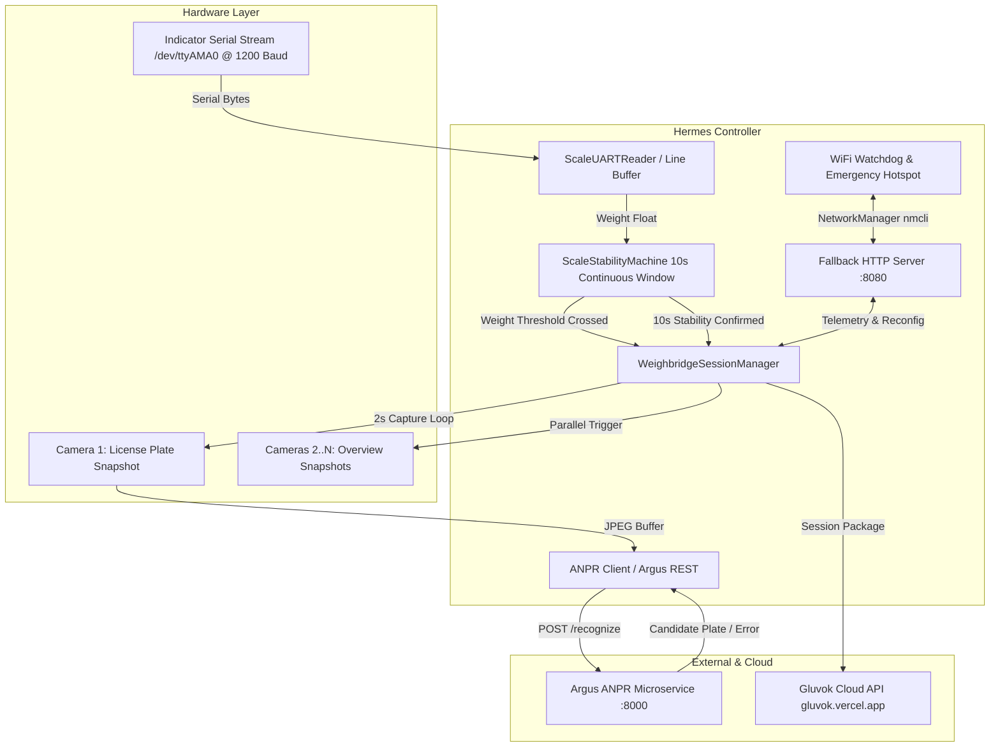
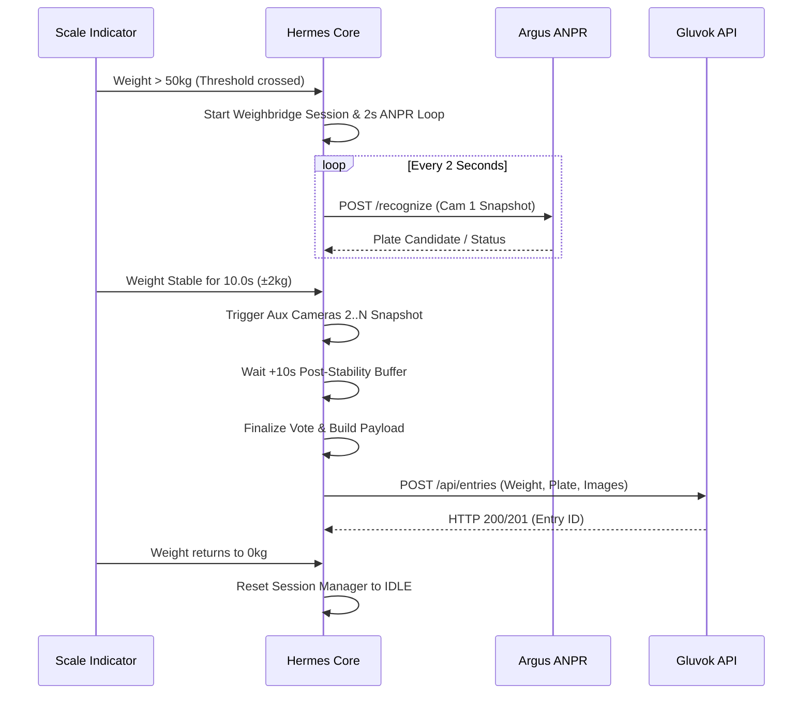

# Hermes System Architecture Guide

`hermes` is an industrial weighing bridge integration controller deployed on a Raspberry Pi. It synchronizes scale serial indicators, automated multi-camera captures, FastAPI-based Argus ANPR (Automatic Number Plate Recognition), emergency fallback Wi-Fi networking, and cloud database persistence via the Gluvok API.

---

## 1. High-Level System Architecture



---

## 2. Component Breakdown

### 2.1 Core Business Logic (`src/core/`)
- **`WeighbridgeSessionManager` (`session.py`)**:
  - Coordinates the session lifecycle (`PHASE_IDLE` -> `PHASE_STABILIZING` -> `PHASE_POST_STABILITY` -> `PHASE_COMPLETED`).
  - Runs a 2-second capture loop on Camera 1 during the stabilization phase.
  - Assembles the final session package containing stable weight, highest-voted plate, and base64 images.
- **`ScaleStabilityMachine` (`stability.py`)**:
  - Requires weight to exceed `min_weight` (default `50.0 kg`) to trigger a weighing session.
  - Implements a continuous 10-second stability check (`STABILITY_TOLERANCE = ±2.0 kg`, `STABILITY_DURATION = 10.0s`).
  - Once stable, transitions to `SCALE_STABLE_RECORDED` to guarantee strictly one upload per truck session.
  - Resets to `SCALE_IDLE` only when weight drops back to `<= 0.0 kg`.
- **`Telemetry Store` (`telemetry.py`)**:
  - Decoupled, thread-safe store for circular system event logs (`max 20 entries`), latest weighment results, and live error counters.
  - Guards state using dedicated threading locks (`_events_lock`, `_live_lock`).

### 2.2 Physical Hardware Devices (`src/devices/`)
- **`ScaleUARTReader` (`scale.py`)**:
  - Connects to the weighing indicator via serial (`/dev/ttyAMA0` or USB serial at 1200 baud, 8N1).
  - Maintains a thread-safe byte buffer (`bytearray`), handling packet terminators (`\r`, `\n`, STX `\x02`, ETX `\x03`) and an inter-character silence flush (300 ms).
  - Uses regex extraction (`rb"([0-9]{3,6})MN"` and flexible signed float patterns) to parse numeric weights.
- **`Camera Manager` (`camera.py`)**:
  - Low-memory HTTP snapshot grabber with optional OpenCV RTSP single-frame fallback.
  - Concurrently captures overview angles (Cameras 2..N) upon stabilization using a bounded `ThreadPoolExecutor`.
- **`WiFi Manager` (`wifi.py`)**:
  - Continuously monitors active Wi-Fi connection via `nmcli`.
  - Automatically spins up an emergency Wi-Fi Access Point (`Gluvok-Setup` / `gluvok1234`) on `wlan0` if connection to the facility router is lost, allowing on-site technicians to connect directly.

### 2.3 External Integrations (`src/integrations/`)
- **`Argus ANPR Client` (`anpr.py`)**:
  - Sends raw JPEG bytes to the Argus FastAPI microservice endpoint (`/recognize`).
  - Supports both full Argus `RecognitionResponse` schemas and flat JSON schemas with pre-screening error detection (`REJECTED_HUMAN_DETECTED`, `NO_PLATE_DETECTED`).
  - Employs a frequency counter (`get_highest_frequency_plate`) to pick the consensus plate candidate across multi-sample captures.
- **`Gluvok Cloud API Client` (`gluvok.py`)**:
  - Exposes `GLUVOK_BASE_URL` and `get_device_headers()` for stateless edge device authentication (`x-device-id`, `x-device-key`).
  - Validates and sanitizes license plate numbers against Indian registration number patterns (`INDIAN_PLATE_REGEX`).
  - Structures weighment session data and RFC 2397 base64-encoded snapshot images directly for `POST /api/entries`.
  - Handles response status codes: `200`/`201` success, `401 Unauthorized`, `403 Forbidden`, `400 Bad Request`, and server/network errors.

### 2.4 Diagnostics Web Dashboard (`src/web/`)
- **Application Factory (`app.py`)**:
  - Implements `create_app()` constructing the Flask WSGI application with custom error handlers, templates directory bindings, and global security headers (`X-Content-Type-Options: nosniff`, `X-Frame-Options: DENY`).
- **Blueprints (`src/web/blueprints/`)**:
  - `views.py`: Serves the embedded dashboard (`templates/index.html`) across subsystem routes (`/`, `/scale`, `/anpr`, `/cloud`, `/wifi`, `/telemetry`, `/errors`, `/config`).
  - `api.py`: Implements RESTful endpoints:
    - `POST /api/login`: Issues session tokens with sliding 2h expiration, brute-force defense (5 attempts/60s), and constant-time credential comparison (`auth.py`).
    - `GET /api/status`: Real-time operational telemetry snapshot.
    - `GET /api/config` & `POST /api/config`: Live reconfiguration of threshold weight, serial port/baud, and camera URLs with input sanitization (`validation.py`) and dynamic UART restart.
    - `POST /api/wifi` & `POST /api/wifi/clear`: Facility Wi-Fi provisioning and credential clearing.
- **Authentication & Security Middleware (`auth.py`)**:
  - Cryptographic token generator and `@auth_required` decorator supporting `Authorization: Bearer` and `X-Auth-Token` headers.
- **Server Runner (`server.py`)**:
  - `FallbackWebServer` wraps Werkzeug's `make_server` to serve the WSGI application in a background daemon thread with graceful `start()` and `stop()` lifecycle management.

### 2.5 Configuration Management (`src/config/`)
- **`config_manager.py`**:
  - Persistent JSON-backed storage (`config.json`) with `threading.RLock()` synchronization.
  - Singleton providing system-wide settings with fallback defaults, disk persistence, and dynamic getters for camera and ANPR URLs.
- **`constants.py`**:
  - Centralized repository of all system constants, timing windows, timeouts, buffer sizes, and validation regexes.

---

## 3. Data Flow



---

## 4. Threading & Concurrency Architecture (Raspberry Pi 5 & Python 3.14)

Hermes operates as a real-time industrial appliance controller on a Raspberry Pi 5 (Quad-Core 64-bit Arm Cortex-A76 @ 2.4 GHz) running **Python 3.14**.

### 4.1 Thread Topology & Real-Time Isolation

Because Python 3.14 on a multi-core Pi 5 supports free-threaded CPython (PEP 703 / optional GIL) and releases the GIL during all socket I/O, serial reads, subprocesses, and sleep states, Hermes uses decoupled daemon threads rather than heavyweight multiprocessing:

| Thread Name | Type / Lifecycle | Execution Frequency / Trigger | Non-Blocking Guarantee |
| :--- | :--- | :--- | :--- |
| **`ScaleUART`** | Dedicated Daemon Thread | Continuous (50ms read, 300ms flush) | Reads `/dev/ttyAMA0` serial bytes; never blocks on network or camera I/O. |
| **`FallbackWebServer`** | Werkzeug WSGI Daemon Thread | Persistent on port `:8080` | Serves web UI and REST API asynchronously without delaying scale operations. |
| **`WiFiWatchdog`** | Dedicated Daemon Thread | Every 30.0s | Runs `nmcli` network checks and controls emergency AP fallback independently. |
| **`ANPRLoop_<id>`** | Ephemeral Session Thread | Every 2.0s during weighing | Fetches Cam 1 frame and queries Argus microservice asynchronously. |
| **`AuxCapture_<id>`** | Ephemeral Session Worker | Triggered upon 10s stability | Fetches overview angles (Cams 2..N) via `ThreadPoolExecutor(4)` without stalling serial reads. |
| **`SpoolWorker`** | Dedicated Daemon Thread | Event-driven + 5.0s poll | Sequentially leases records from SQLite WAL queue and uploads to Gluvok API via multipart POST; completely non-blocking to scale UART. |

### 4.2 Python 3.14 Free-Threading & Synchronization Invariants

Under Python 3.14, threads execute with true hardware parallelism across all 4 Cortex-A76 cores. To prevent data races in free-threaded mode:
- **`ConfigManager`**: All mutable properties and disk serialization (`config.json`) are guarded by `threading.RLock()`.
- **`ScaleUARTReader`**: Line buffer bytearray and inter-character timeout tracking are synchronized via `threading.Lock()`.
- **`WeighbridgeSessionManager`**: Phase transitions, frame buffers, and candidate plate lists are guarded by `threading.Lock()`.
- **`telemetry.py`**: Telemetry circular buffer and live error statistics are guarded by `_events_lock` and `_live_lock`.
- **`db.py`**: SQLite database operations, schema creation, and atomic lease acquisitions are synchronized with `_db_lock`.

---

## 5. Local Durable Outbox Storage & Anti-Duplication Architecture

To guarantee zero data loss during power loss or offline network drops, Hermes employs a **Write-Ahead Local Outbox Spool**:

```
WEIGHMENT FINALIZED
        │
        ▼
SQLite WAL Database (data/hermes.db)
- weighment_spool: status='PENDING', lease_until=0, session_id (UNIQUE)
- spool_images: raw binary BLOBs (cam1 + auxiliary)
        │
        ▼
Single SpoolWorker (FIFO Sequential Processing)
        │
        ├── 1. Acquire Atomic Lease Lock (status='UPLOADING', lease_until=now+60s)
        │      (Prevents concurrent worker threads or timer ticks from double-sending)
        │
        ├── 2. Execute Multipart POST (-u "pi1:hardware123")
        │      - Fields: center_id, detected_vehicle_number, weight
        │      - Files: file=@truck_001.jpg;type=image/jpeg
        │      │
        │      ├── HTTP 200/201 (Success) ──► ACKNOWLEDGED (cloud_entry_id recorded)
        │      │
        │      ├── Connect Failure (Socket / DNS / Wi-Fi drop)
        │      │   └── Safe RETRY: Data never left the device, 0% chance cloud received it.
        │      │
        │      └── Read Timeout / Mid-Stream Drop (Ambiguous: Did cloud commit before drop?)
        │          └── VERIFY-BEFORE-RETRY Protocol:
        │              1. Query Cloud GET /api/entries?center_id=X&detected_vehicle_number=Y
        │              2. If entry with matching plate and weight within past 5m exists:
        │                 Mark as ACKNOWLEDGED (Avoid duplicate upload!)
        │              3. If confirmed not present:
        │                 Schedule RETRY with exponential backoff (5s, 10s, 20s... max 300s + jitter).
```


