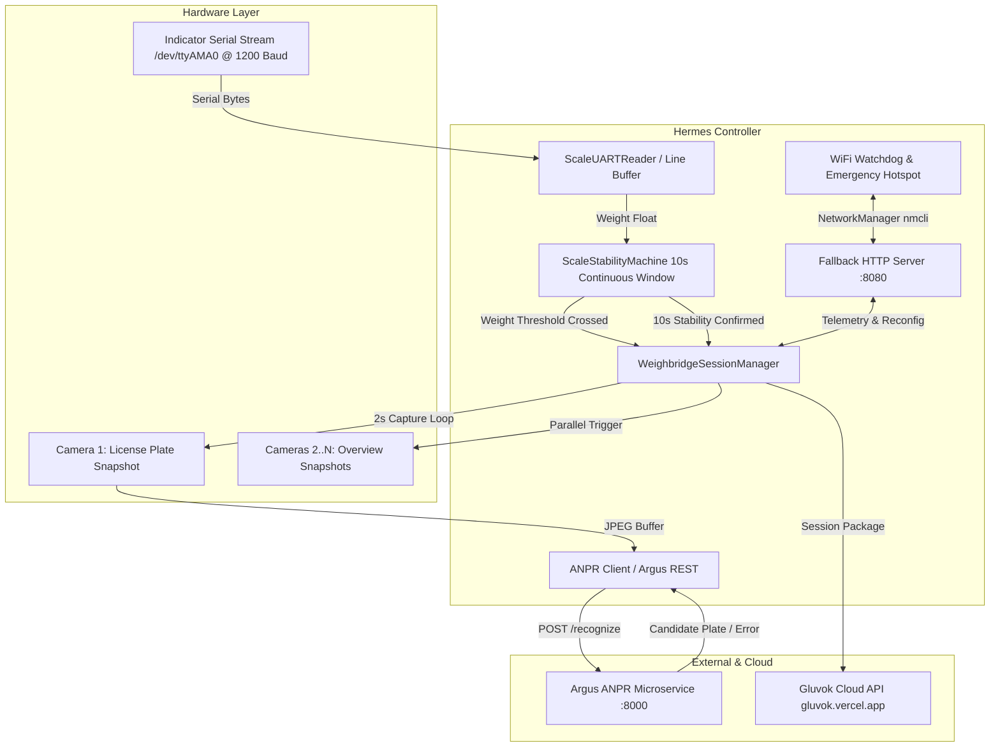

# Hermes System Architecture Guide

`hermes` is an industrial weighing bridge integration controller deployed on a Raspberry Pi. It synchronizes scale serial indicators, automated multi-camera captures, FastAPI-based Argus ANPR (Automatic Number Plate Recognition), emergency fallback Wi-Fi networking, and cloud database persistence via the Gluvok API.

---

## 1. High-Level System Architecture

---

## 2. Component Breakdown

### 2.1 Scale Subsystem (`src/scale/`)
- **`ScaleUARTReader` (`scale_uart.py`)**:
  - Connects to the weighing indicator via serial (`/dev/ttyAMA0` or USB serial at 1200 baud, 8N1).
  - Maintains a thread-safe byte buffer (`bytearray`), handling packet terminators (`\r`, `\n`, STX `\x02`, ETX `\x03`) and an inter-character silence flush (300 ms).
  - Uses regex extraction (`rb"([0-9]{3,6})MN"` and flexible signed float patterns) to parse numeric weights.
- **`ScaleStabilityMachine` (`scale_stability.py`)**:
  - Requires weight to exceed `min_weight` (default `50.0 kg`) to trigger a weighing session.
  - Implements a continuous 10-second stability check (`STABILITY_TOLERANCE = ±2.0 kg`, `STABILITY_DURATION = 10.0s`).
  - Once stable, transitions to `SCALE_STABLE_RECORDED` to guarantee strictly one upload per truck session.
  - Resets to `SCALE_IDLE` only when weight drops back to `<= 0.0 kg`.

### 2.2 Camera & ANPR Subsystem (`src/camera/`)
- **`camera_manager.py`**:
  - Low-memory HTTP snapshot grabber with optional OpenCV RTSP single-frame fallback.
  - Concurrently captures overview angles (Cameras 2..N) upon stabilization using a bounded `ThreadPoolExecutor`.
- **`anpr_client.py`**:
  - Sends raw JPEG bytes to the Argus FastAPI microservice endpoint (`/recognize`).
  - Supports both full Argus `RecognitionResponse` schemas and flat JSON schemas with pre-screening error detection (`REJECTED_HUMAN_DETECTED`, `NO_PLATE_DETECTED`).
  - Employs a frequency counter (`get_highest_frequency_plate`) to pick the consensus plate candidate across multi-sample captures.
- **`session_manager.py`**:
  - Coordinates the session lifecycle (`PHASE_IDLE` -> `PHASE_STABILIZING` -> `PHASE_POST_STABILITY` -> `PHASE_COMPLETED`).
  - Runs a 2-second capture loop on Camera 1 during the stabilization phase.
  - Assembles the final session package containing stable weight, highest-voted plate, and base64 images.

### 2.3 Network & Cloud Subsystem (`src/network/`)
- **`cloud_auth.py` & `cloud_client.py`**:
  - Manages JWT device authentication against the Gluvok REST API (`/api/auth/login` and `/api/auth/refresh`).
  - Tracks token expiry and automatically attempts token refresh or re-login upon 401 Unauthorized responses.
- **`cloud_post.py`**:
  - Validates and sanitizes license plate numbers against Indian registration number patterns (`INDIAN_PLATE_REGEX`).
  - Posts weighment session data and base64-encoded snapshot images directly to `/api/entries`.
- **`wifi_manager.py`**:
  - Continuously monitors active Wi-Fi connection via `nmcli`.
  - Automatically spins up an emergency Wi-Fi Access Point (`Gluvok-Setup` / `gluvok1234`) on `wlan0` if connection to the facility router is lost, allowing on-site technicians to connect directly.

### 2.4 Diagnostics Web Dashboard (`src/web/`)
- **Application Factory (`app.py`)**:
  - Implements `create_app()` constructing the Flask WSGI application with custom error handlers, templates directory bindings, and global security headers (`X-Content-Type-Options: nosniff`, `X-Frame-Options: DENY`).
- **Blueprints (`src/web/blueprints/`)**:
  - `views.py`: Serves the embedded dashboard (`templates/index.html`) across subsystem routes (`/`, `/scale`, `/anpr`, `/cloud`, `/wifi`, `/telemetry`, `/errors`, `/config`).
  - `api.py`: Implements RESTful endpoints:
    - `POST /api/login`: Issues session tokens with sliding 2h expiration, brute-force defense (5 attempts/60s), and constant-time credential comparison (`auth.py`).
    - `GET /api/status`: Real-time operational telemetry snapshot.
    - `GET /api/config` & `POST /api/config`: Live reconfiguration of threshold weight, serial port/baud, and camera URLs with input sanitization (`validation.py`) and dynamic UART restart.
    - `POST /api/wifi` & `POST /api/wifi/clear`: Facility Wi-Fi provisioning and credential clearing.
- **State & Telemetry Store (`state.py`)**:
  - Thread-safe decoupled store for circular system event logs (`max 20 entries`), latest weighment results, and live error counters.
- **Authentication & Security Middleware (`auth.py`)**:
  - Cryptographic token generator and `@auth_required` decorator supporting `Authorization: Bearer` and `X-Auth-Token` headers.
- **Server Runner (`server.py`)**:
  - `FallbackWebServer` wraps Werkzeug's `make_server` to serve the WSGI application in a background daemon thread with graceful `start()` and `stop()` lifecycle management.

### 2.5 Configuration Management (`src/config/`)
- **`config_manager.py`**:
  - Persistent JSON-backed storage (`config.json`).
  - Thread-safe singleton providing system-wide settings with fallback defaults.
- **`camera_config.py`**:
  - Dynamic getters for camera snapshot and ANPR endpoints, reflecting changes saved via the web dashboard immediately.

---

## 3. Data Flow

